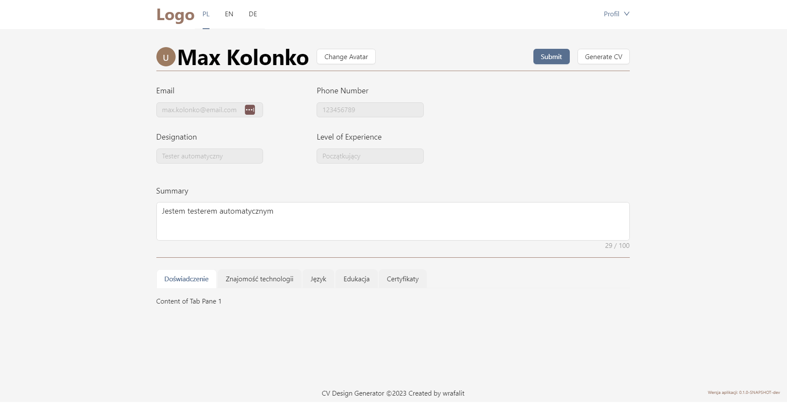
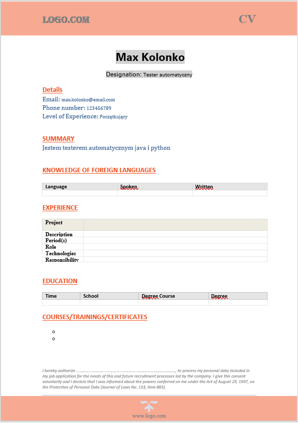

# CV-Generator

Warning: This is a work in progress. The application is not yet ready for production use.  

CV-generator is a java spring-boot and React based web application that allows you to create docx cv file
easily.

## How to run the application

1. In order to get this application up and running quickly, you will need to have `java`  run-time installed
   on your computer.
2. Now, run the following one by one in the given sequence: 
   a) `java spring application` 
   b) `react application \src\js> npm start` 
3. The application should be up and running on the following `URL: http://localhost:3000`

## How to use CV-Generator

1. On the welcome screen, use one of two accounts: 
   `email: max.kolonko@email.com` or `email: jan.kowalski@email.com` 
2. Once, you are logged in you can change summary, update given information and then click submit button to save your
   changes.
3. Clicking generate will generate a docx of your resume file.

## User Stories

- Users can fill resume form, and create a beautiful resume quickly.
- Users can generate cv docx resume file.

## Features

- Simple and easy to understand code which is built following Spring MVC design pattern CQRS.
- Straightforward and simple User Interface.
- POI library is used to generate docx file.

## Future features

- Spring security can be used to add more features like user login, registration, password reset, etc.
- Resolve obvious defects and layout.
- Finished complete docker-compose file to further simplify the deployment of the application.

## Dependencies

- Spring boot, Spring MVC, Spring Security, Spring ORM
- H2 DEV / MySQL PROD, Hibernate
- React JS
- Enterprise Java
- JSP and Servlets

## What the app looks like

